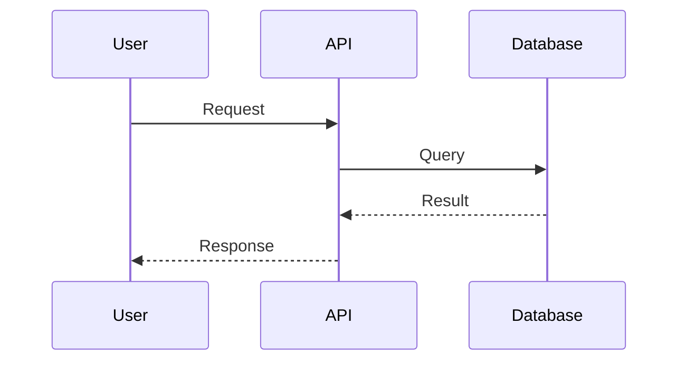
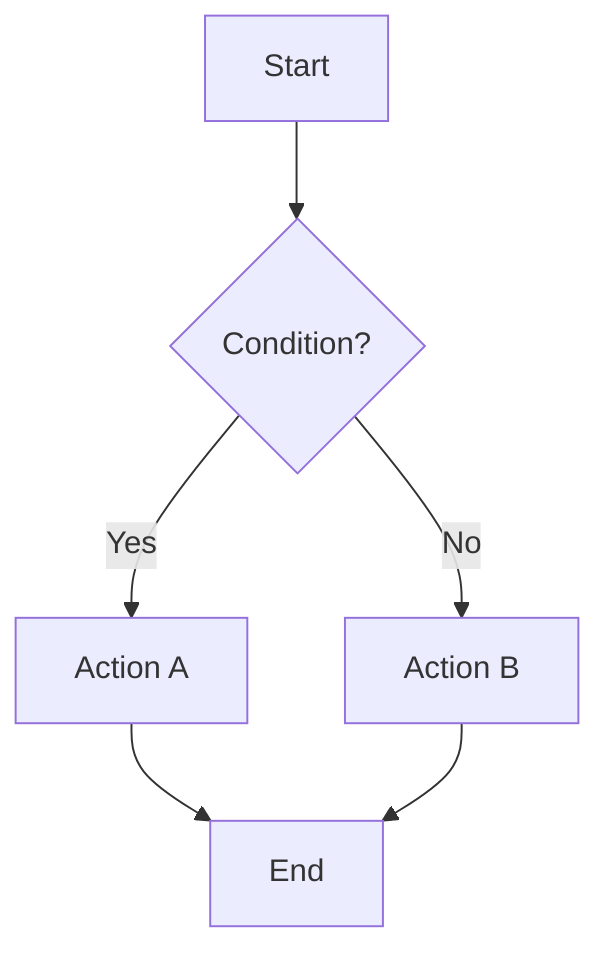
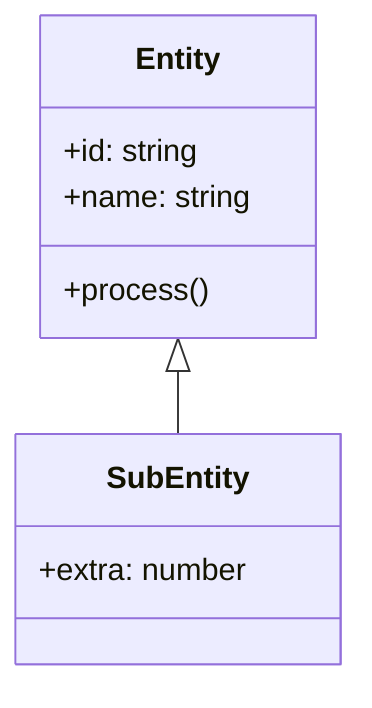
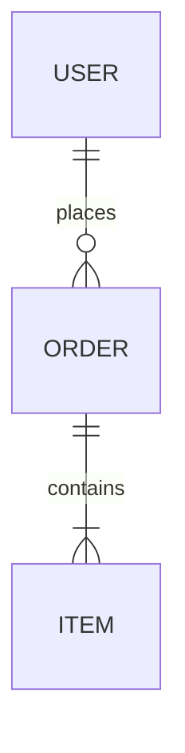
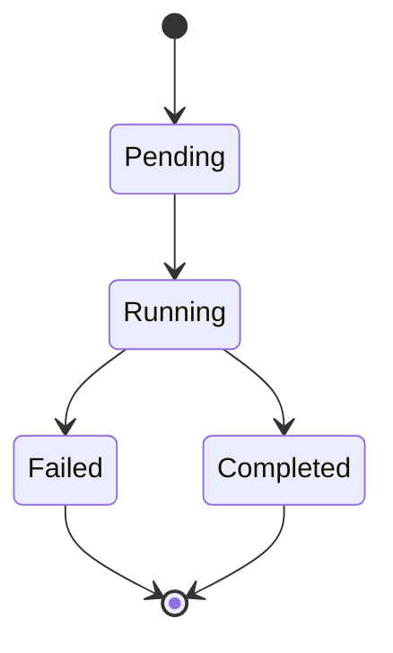
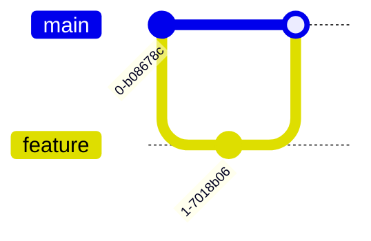
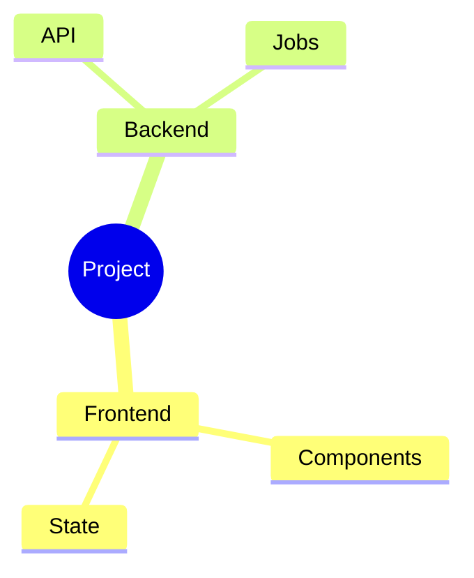
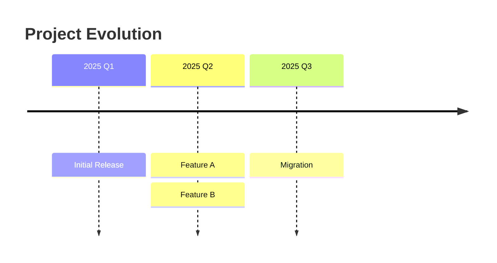

# Documentation Generator

Generate and maintain comprehensive project documentation with visual diagrams to help both agents and humans quickly understand the codebase.

## When to Use

- User explicitly requests documentation update ("document this", "update docs", "/docs")
- After implementing a significant feature or architectural change
- When establishing new patterns or conventions worth documenting
- When debugging reveals non-obvious system behaviors worth capturing

## Documentation Strategy

### 1. Discovery Phase

**Check for existing documentation:**
- Look for `docs/` directory at project root
- If it exists, read the directory structure to understand current organization
- Identify relevant existing docs that may need updates

**If no `docs/` directory exists:**
- Create `docs/` at project root
- Create initial structure based on project domains

### 2. Session Analysis

Review the current conversation to identify:

**Architectural Insights:**
- System design decisions and their rationale
- Component interactions and data flows
- Integration patterns between subsystems
- Non-obvious coupling or dependencies

**Patterns & Conventions:**
- Code organization patterns
- Naming conventions
- Error handling strategies
- Testing approaches
- Data modeling patterns

**Workflows & Processes:**
- Development workflows (build, test, deploy)
- Data pipelines and processing flows
- User interaction flows
- Background job orchestration

**Technical Decisions:**
- Technology choices and why
- Trade-offs made
- Alternative approaches considered and rejected
- Performance considerations

### 3. Content Organization

**Directory Structure:**
```
docs/
├── architecture/       # High-level system design
├── components/        # Component-specific docs
├── workflows/         # Process flows and pipelines
├── patterns/          # Reusable patterns and conventions
├── integrations/      # External service integrations
├── data-models/       # Entity relationships and schemas
└── troubleshooting/   # Common issues and solutions
```

**Organize by domain, not by artifact type.** For example:
- ✅ `docs/beauty-scraper/pipeline.md`, `docs/beauty-scraper/data-model.md`
- ❌ `docs/pipelines/beauty.md`, `docs/models/beauty.md`

### 4. Diagram Usage (CRITICAL)

**Always create diagrams when documenting:**

**Use mermaid diagrams extensively.** Diagrams communicate structure faster than prose:

**Sequence Diagrams** - for workflows, API calls, data flows:


**Flowcharts** - for decision trees, state machines, algorithms:


**Class Diagrams** - for entity relationships, type hierarchies:


**ER Diagrams** - for database schemas:


**State Diagrams** - for state machines, job lifecycles:


**Git Graph** - for workflow visualization:


**Mindmap** - for conceptual hierarchies:


**Timeline** - for project phases, migrations:


**Place diagrams BEFORE detailed text** - visual overview first, details second.

### 5. Document Structure Template

Each documentation file should follow this structure:

```markdown
# [Topic Name]

<!-- Brief one-sentence summary -->

## Overview

[2-3 paragraph explanation of what this is and why it exists]

## Architecture

[Mermaid diagram showing the high-level structure]

## Key Concepts

- **Concept 1**: Brief explanation
- **Concept 2**: Brief explanation

## How It Works

[Sequence or flowchart diagram showing the main workflow]

[Step-by-step explanation matching the diagram]

## Implementation Details

### Component A
[Details about this component]

### Component B
[Details about this component]

## Usage Examples

```[language]
// Code example
```

## Common Patterns

[Patterns specific to this domain]

## Troubleshooting

### Issue: [Common Problem]
**Symptom**: What you see
**Cause**: Why it happens
**Solution**: How to fix it

## Related Documentation

- [Link to related doc]
- [Link to related doc]

---
*Last updated: YYYY-MM-DD*
*Session: [Brief context about what prompted this update]*
```

### 6. Update Strategy

**For existing docs:**
1. Read the current content
2. Identify outdated sections
3. Preserve structure and add/update sections
4. Update "Last updated" timestamp
5. Add session context note

**For new docs:**
1. Create in appropriate domain folder
2. Follow structure template
3. Add cross-references to related docs
4. Update parent README if exists

**Always:**
- Keep language clear and concise
- Use active voice
- Define technical terms on first use
- Include code examples where helpful
- Add dates to time-sensitive information

### 7. Cross-Referencing

Create `README.md` files at each level:

**`docs/README.md`** - project-wide documentation index:
```markdown
# Project Documentation

## Architecture
- [System Overview](architecture/overview.md)
- [Component Design](architecture/components.md)

## Workflows
- [Scraping Pipeline](workflows/scraping-pipeline.md)
- [Job Orchestration](workflows/job-orchestration.md)
```

**Domain-level READMEs** link to specific docs in that domain.

### 8. Quality Checklist

Before finalizing documentation:

- [ ] Includes at least one diagram showing the main flow/structure
- [ ] Overview explains "what" and "why" clearly
- [ ] Technical terms are defined
- [ ] Code examples are complete and correct
- [ ] Cross-references to related docs exist
- [ ] "Last updated" timestamp is current
- [ ] Session context note explains what changed

## Output Format

After generating/updating documentation, summarize what was done:

```
Updated documentation in docs/:

Created:
- docs/beauty-scraper/pipeline.md - Scraping pipeline architecture and workflow
- docs/beauty-scraper/data-model.md - Product entity relationships

Updated:
- docs/workflows/job-orchestration.md - Added pause/resume pattern
- docs/README.md - Added beauty-scraper section

Diagrams added: 3 sequence diagrams, 2 flowcharts, 1 state diagram
```

## Examples

See the `examples/` directory for sample documentation following these conventions.
